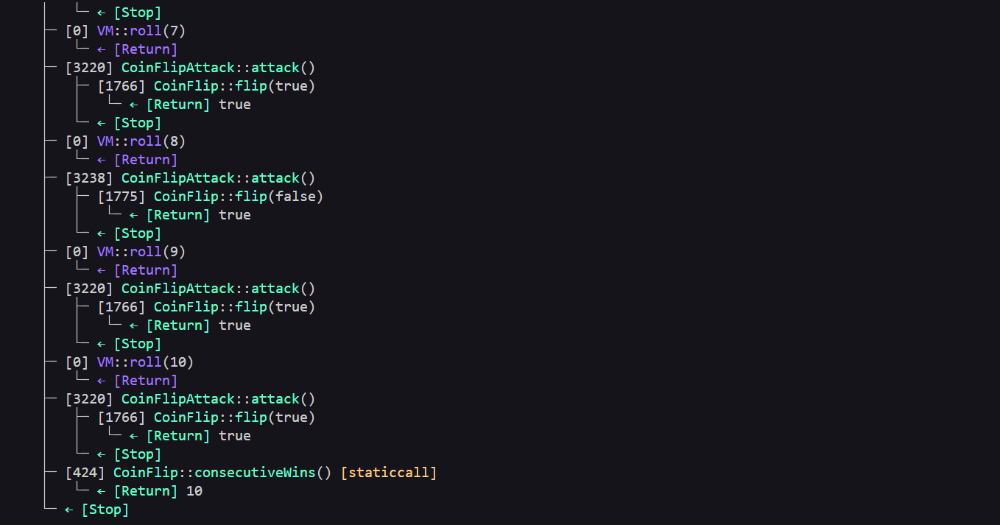

# Coin Flip Level - Exploit PoC (Proof of Concept)

## Overview
The contract relies on `blockhash` to generate a pseudo-random number. This approach does not provide true randomness, as `blockhash`is a public value accessible to **anyone** on the blockchain, making the outcome fully predictable.


## Vulnerabilities Highlighted 
```solidity function flip(bool _guess) public returns (bool) {
       uint256 blockValue = uint256(blockhash(block.number - 1));
        
        if (lastHash == blockValue) {
            revert();
        }

        lastHash = blockValue;
        uint256 coinFlip = blockValue / FACTOR; // Critical: Deterministic value, predictable by anyone.
        bool side = coinFlip == 1 ? true : false; 

        if (side == _guess) {
            consecutiveWins++;
            return true;
        } else {
            consecutiveWins = 0;
            return false;
        }
  
}
```
## Vulnerability Explained 
- Type: Predictable randomness via public blockhash.
- Root Cause: The blockhash of the previous block is a deterministic and publicly accessible value. Any contract or actor can replicate the same calculation, making it possible to predict the correct outcome before submitting the guess.

- Severity: High
Attacker can predict every flip outcome and reach **consecutiveWins = 10 with** 100% success rate.

### Steps of the Exploit PoC

1- Deploy the **CoinFlipAttack** contract pointing to the target instance.
2- Call **attack()** multiple times (once per block) until **consecutiveWins** reaches 10.


#### Evidence 

##### Local/Foundry

- Tests passing with assertions: 
    -  assertEq(coinFlip.consecutiveWins(), 10);

    

##### Real Testnet (Sepolia)
- [Transaction calling Attack():](https://sepolia.etherscan.io/tx/0xb6553f4d14c4e16214f2939cc7ca818c3589806edf6dfd472e1057294fb2296e)
- [Attack Contract Adddress:](https://sepolia.etherscan.io/address/0x09AABab8150e95D5ed5a7b840cF1256e125C5f16)

## Recommended Mitigation
- Use a verifiable off-chain randomness solution such as [Chainlink VRF():](https://docs.chain.link/vrf)

## Lessons Learned

- On-chain values such as **blockhash**,**block.time** and **block.number** must never be used as sources of randomness.
- Always rely on off-chain oracles or on-chain VRF solutions for unpredictable and tamper-resistant random number generation.

## Files
- [Attacker Contract Code](../../src/coinFlip/CoinFlipAttack.sol)
- [Exploit Test Code](../../test/coinFlip/CoinFlipTest.t.sol)
- [Broadcast Script](../../script/coinFlip/CoinFlipComplete.s.sol)

This is a full Exploit PoC: Reproduced locally with Foundry ans broadcasted on Sepolia testnet.