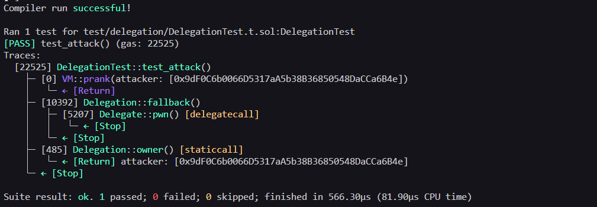

# Delegation Level - Exploit PoC (Proof of Concept)

## Overview
The contract uses a `delegate call` to execute code from the `Delegate`contract, but the `Delegation` contract does not have any access control to verify who is triggering this call. This means anyone can call `pwn()` via the unprotected fallback function and gain ownership of the `Delegation` contract.


## Vulnerabilities Highlighted 
```solidity fallback() external {
        (bool result,) = address(delegate).delegatecall(msg.data);
        if (result) {
            this; // Critical: does nothing, no access control, no validation.
        }
    }
```
## Vulnerability Explained 
- Type: Unauthorized `delegation call` via unprotected fallback function.
- Root Cause: The fallback function accepts any `msg.data` and executes it via `delegate call` without verifying who is calling or what is being executed. Since `delegate call` runs code in the caller's context, calling `pwn()` changes the owner of `Delegation`, not `Delegate`.
- Severity: High-Anyone can gain ownership of the contract with a single transaction.

### Steps of the Exploit PoC

1- Send a transaction to `Delegation` with **msg.data = abi.encodeWithSignature("pwn()")**
2- The fallback triggers -> executes **delegate call with pwn()**.
3- own() runs in the context of `Delegation -> owner = msg.sender -> attacker becomes owner`.


#### Evidence 

##### Local/Foundry

- Tests passing with assertions: 
    -  assertEq(delegation.owner(), attacker);

    

##### Real Testnet (Sepolia)
- [Transaction calling pwn():](https://sepolia.etherscan.io/tx/0x1edb65e1b83a9dda43409b183deb4a70245a06668491dc896a7015dccc6ed030)


## Recommended Mitigation
- Restrict who can trigger the fallback function.
- Validate `msg.data` before executing `delegate call`.
- Avoid using `delegate call`in fallback function without strict
## Lessons Learned

- Delegate call executes code from another contract but in the caller's context, storage and ownership changes happen in the calling contract.
- An unprotected fallback with delegate call is a critical vulnerability.
- `if (result) {this}` is meaningless code, always handle results properly with `require`
- Always audit contract that use delegate call carefully.

## Files
- [Delegation Contract](../../src/delegation/Delegation.sol)
- [Exploit Test Code](../../test/delegation/DelegationTest.t.sol)
- [Broadcast Script](../../script/delegation/DelegationAttack.s.sol)

This is a full Exploit PoC: Reproduced locally with Foundry ans broadcasted on Sepolia testnet.