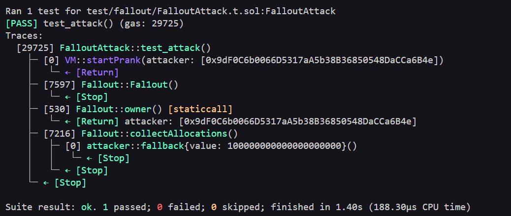

# Fallout Level - Exploit PoC (Proof of Concept)

## Overview
The contract has a **fake constructor** (`Fal1out`), this is actually a normal public function. This typo allows **anyone** to call it and instantly become the owner.

## Vulnerabilities Highlighted 
```solidity function Fal1out() public payable {
    owner = payable(msg.sender);
    allocations[owner] = msg.value;  // Critical: anyone calling this gains full ownership
}
```
## Vulnerability Explained 
- Type: Ownership takeover via fake constructor function.
- Root Cause: In older solidity versions the constructors were functions with the same name as the contract. The typo Fal1out (instead of Fallout) makes it a regular public function anyone can call, setting ``owner = msg.sender``.

- Severity: High
Attacker gains full control of the contract with a single call.

### Steps of the Exploit PoC

1- Call Fal1out() (optionally with value, but 0 ETH works).
2- (Optional but typical) Call collectAllocations() as the new owner to drain the contract balance

#### Evidence 

##### Local/Foundry

- Tests passing with assertions: 
    - assertEq(fallout.owner(), attacker) after calling Fal1out()
    - assertEq(address(fallout).balance, 0) after drain
    

##### Real Testnet (Sepolia)
- [Transaction calling Fal1out():](https://sepolia.etherscan.io/tx/0x4062b2887373b28531eb429781e1596304e9514f400e400a4c3ab1870c8edfd9)
- [Transaction calling collectAllocations():](https://sepolia.etherscan.io/tx/0xc9a59dae613cce0c715256384b85544aec050556b383465ef4742fb28d6983c3)

## Recommended Mitigation
- Use the modern `constructor` keyword (Solidity >= 0.4.22).
- Enable compiler version locks (`pragma solidity ^0.8.0`) to avoid legacy patterns.

## Lessons Learned

- Typos in critical functions can be catastrophic.
- Always use the `constructor` keyword in modern Solidity.
- Code review should catch naming mismatches between contract and "constructor".

## Files
- [Exploit Test Code](../../test/fallout/FalloutTest.t.sol)
- [Broadcast Script](../../script/fallout/FalloutAttack.s.sol)

This is a full Exploit PoC: reproduced locally with Foundry, broadcasted on Sepolia testnet.