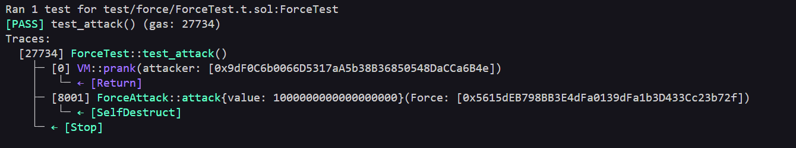

# Force Level - Exploit PoC (Proof of Concept)
    
## Overview 
The contract is completely empty, it has no **receive()** or **fallback()** function, which means it cannot accept ETH through normal transfers. However, it is still possible to force ETH into using **selfdestruct**, which bypasses all recipient restrictions.

## Vulnerabilities Highlighted 

```solidity contract Force { /*
                   MEOW ?
         /\_/\   /
    ____/ o o \
    /~____  =ø= /
    (______)__m_m)
                   */ }
```

## Vulnerability Explained
- Type: Forced ETH transfer via **selfdestruct**.
- Root Cause: In Solidity, **selfdestruct** sends all ETH from a contract to a target address regardless of whether the target has a **receive()** or **fallback()** function. This makes it impossible for a contract to truly reject ETH.
-Severity: Medium - An Attacker can force ETH into the contract, potentially breaking logic that assumes the balance is always zero.

### Steps of the Exploit PoC

1- Deploy the **ForceAttack** contract with some ETH.
2- Call **attack()** passing the target address, **selfdestruct** forces ETH into the **Force** contract.
3- The **Force** contract now has a balance greater than zero.

### Evidence
##### Local/Foundry

- Tests passing with assertions:
  - assertGt(address(force).balance, 0)
    

##### Real Testnet (Sepolia)
- [Transaction calling Attack():](https://sepolia.etherscan.io/tx/0x338dfe62be8d0130028f85f8978e9e73048cc5043f230d3b6c71504511230e37)
- [Attack Contract Address:](https://sepolia.etherscan.io/address/0xcb8a70dcce4a4343654d6903d5c16f90517054dc  )

## Recommended Mitigation

- Never assume a contract's balance is zero, anyone can force ETH into any contract via **selfdestruct**.
- Avoid using address(this).balance as a security check, as i can be manipulated.

## Lessons Learned

- **selfdestruct** bypasses all ETH recipient restrictions, no **receive()** or **fallback()** needed.
- A contract's balance can never be fully protected from external ETH injection.
- Logic that relies on **address(this).balance == 0)** is inherently unsafe.

## Files

- [Attacker Contract Code](../../src/force/ForceAttack.sol)
- [Exploit Test Code](../../test/force/ForceTest.t.sol)
- [Broadcast Script](../../script/force/ForceScript.s.sol)

This is a full Exploit PoC: Reproduced locally with Foundry ans broadcasted on Sepolia testnet.