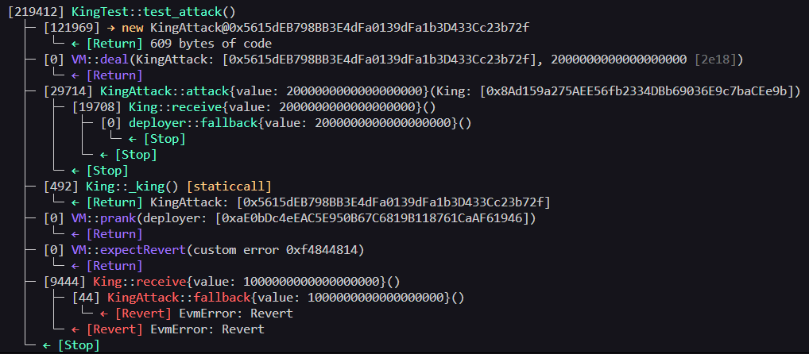

# King Level - King PoC (Proof of Concept)

## Overview
The King contract implements a simple game where whoever send more ETH than the current prize becomes the new king. The previous king receives the new prize amount via `transfer()`. The vulnerability lies in the assumption that the current king can always receive ETH, if the king is a smart contract without a `receive()` or `fallback()` function, the `transfer()` call will revert, permanently breaking the game and making it impossible for anyone to claim the throne.

## Vulnerabilities Highlighted 

```solidity receive() external payable {
        require(msg.value >= prize || msg.sender == owner);
        payable(king).transfer(msg.value);
        king = msg.sender;
        prize = msg.value;
    }
```

## Vulnerability Explained
- Type: Denial of Service (DoS) via revert on ETH transfer.
- Root Cause: The contract uses `transfer()` to send ETH to the current king. If the kins is a contract that does not implement `receive()` or `fallback()` the `transfer()`call will always revert, blocking any new "king" from being set and freezing the contract state permanently.
- Severity: High - An attacker can permanently block the game, preventing anyone from reclaiming kingship.

### Steps of the Exploit PoC

1- Check the current prize value of the King contract. (`call cast <CONTRACT_ADDRESS> "prize()(uint256) --rpc_url $SEPOLIA_RPC_URL`).
2- Deploy an attacker contract without a receive() or fallback() function.
3- Call attack() from the attacker's contract.

### Evidence
##### Local/Foundry

- Tests passing with assertions: 
  -  `assertEq(king._king(), address(kingAttack))`
  - `vm.expectRevert()`.

  

##### Real Testnet (Sepolia)  
- [Transaction calling transfer()](https://sepolia.etherscan.io/tx/0x7184b21925e98196d4e856752d1d20936d3bb4355b0d6562b46e7c34a34b068c)

## Recommended Mitigation

- Replace `transfer()` with the pull payment pattern, instead of pushing ETH to the previous king, let them withdraw it themselves.

## Lessons Learned

- `transfer()` reverts if the recipient cannot receive ETH, this makes it dangerous when sending to unknown or contract addresses.
- A malicious contract without `transfer()` or `fallback` can permanently freeze any contract that depends on pushing ETH.
- Never assume that an address can receive ETH.

## Files
- [Exploit Test Code](../../test/king/KingTest.t.sol)
- [Broadcast Script](../../script/king/KingAttack.s.sol)

This is a full Exploit PoC: Reproduced locally with Foundry ans broadcasted on Sepolia testnet