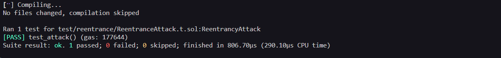

# Reentrancy  Level - Exploit PoC (Proof of Concept)
    
## Overview 
The original Reentrancy contract uses Solidity 0.6.12 (adapted to 0.8  using `unchecked` to replicate the original underflow behavior).

## Vulnerabilities Highlighted 

```solidity function changeOwner(address _owner) public {
        function withdraw(uint256 _amount) public {
        if (balances[msg.sender] >= _amount) {
        (bool result,) = msg.sender.call{value: _amount}("");
        if (result) { _amount; }
        unchecked { balances[msg.sender] -= _amount; }
    }
}
```

## Vulnerability Explained
- Type: Reentrancy
- Root: ETH is sent to the caller before the balance was updated, allowing the caller's receive() to re-enter withdraw() with the same balance still valid.
-Severity: High

### Steps of the Exploit PoC

1- Deploy the ReentranceAttacker contract pointing to the victim.
2- Call attack() with any amount <= victim balance .

### Evidence
##### Local/Foundry

- Tests passing with assertions:
  - assertEq(address(reentrance).balance, 0);
  - assertGt(address(attack).balance, 0);

  

##### Real Testnet (Sepolia)
- [Transaction calling Attack():](https://sepolia.etherscan.io/tx/0x713c7a1cf4dc71aebb51b8ee248c4be2d250dfa7829452a30228ab8c884beae2)
- [Attack Contract Address:]( https://sepolia.etherscan.io/address/0x77dad1c5a9963a560abf8fe507413a6efd2df8c1)

## Recommended Mitigation

- Follow the Checks-Effects-Interaction pattern: always update the balance before transferring ETH.
- Use OpenZeppelin's ReentrancyGuard ( nonReentrant modifier).

## Lessons Learned

- External calls transfer control to untrusted code, any state that guards access must be updated before the call, not after.
- The EVM automatically triggers receive() when ETH arrives without no calldata, this is the reentrancy factor.

## Files

- [Attacker Contract Code](../../src/reentrance/ReentranceAttacker.sol)
- [Exploit Test Code](../../test/reentrace/ReentranceAttack.t.sol)
- [Broadcast Script](../../script/reentrance/ReentranceAttack.s.sol)

This is a full Exploit PoC: Reproduced locally with Foundry ans broadcasted on Sepolia testnet.