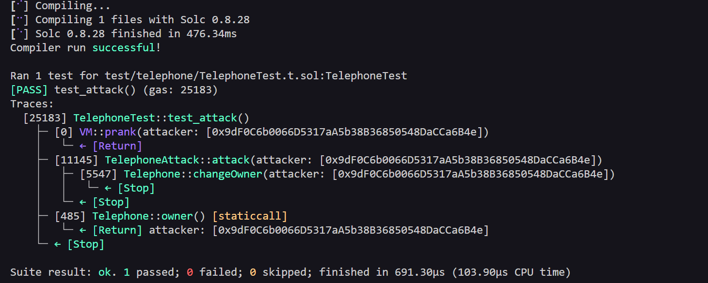

# Telephone Level - Exploit PoC (Proof of Concept)
    
## Overview 
The contract has a function called `changeOwner()` that allows ownership to be transferred to anyone, as long as the call comes from an intermediary contract. This happens because the only check is `tx.origin != msg.sender`, which is easily bypassed by routing the call through another contract.

## Vulnerabilities Highlighted 

```solidity function changeOwner(address _owner) public {
        if (tx.origin != msg.sender) {
            owner = _owner;
        }
}
```

## Vulnerability Explained
- Type: Ownership takeover via intermediary contract call.
- Root Cause: The check `tx.origin != msg.sender` does not properly secure the function. Any attacker can deploy a contract that calls `changeOwner()` on their behalf, making `tx.origin` (the attacker's wallet) different from `msg.sender`(the intermediary contract).
-Severity: High - Anyone can gain ownership of the contract with a single transaction.

### Steps of the Exploit PoC

1- Deploy the **TelephoneAttackScript** contract pointing to the target instance.
2- Call **attack()**, passing the attacker's address as the new owner.

### Evidence
##### Local/Foundry

- Tests passing with assertions:
  - assertEq(telephone.owner(), attacker);

  

##### Real Testnet (Sepolia)
- [Transaction calling Attack():](https://sepolia.etherscan.io/tx/0x075a3dae9df6c1b7820f2c031529a29a1b362a79baccd0e6fd2ef2a038553837)
- [Attack Contract Address:](https://sepolia.etherscan.io/address/0xed230239b9ab0dff5688449e5fc4a0eeda774462)

## Recommended Mitigation

- Use `msg.sender` instead of `tx.origin` for authorization checks.
- Never rely on `tx.origin` for access control, as any intermediary contract can bypass it.

## Lessons Learned

- `tx.origin` should never be used for authorization, it always point to the original wallet and not to the direct caller.
- Any intermediary contract can exploit `tx.origin != msg.sender` checks.

## Files

- [Attacker Contract Code](../../src/telephone/TelephoneAttack.sol)
- [Exploit Test Code](../../test/telephone/TelephoneTest.t.sol)
- [Broadcast Script](../../script/telephone/TelephoneAttackScript.s.sol)

This is a full Exploit PoC: Reproduced locally with Foundry ans broadcasted on Sepolia testnet.