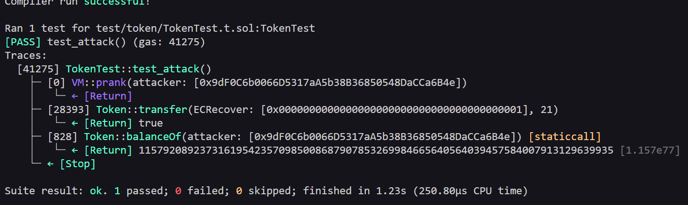

# Token Level - Exploit PoC (Proof of Concept)

## Overview
The contract has a function called `transfer(address _to, uint256 _value)` that is vulnerable to integer underflow. This happens because the function does not properly validade arithmetic operations, allowing an attacker to wrap the balance around to a very large number.

> **Note:** The original contract uses Solidity `^0.6.0` where underflow occurs natively. This versions uses `unchecked` blocks to replicate the same behavior in `^0.8.0`.

## Vulnerabilities Highlighted 

```solidity function transfer(address _to, uint256 _value) public returns (bool) {
        unchecked {
        require(balances[msg.sender] - _value >= 0);
        balances[msg.sender] -= _value;
        balances[_to] += _value;
        }
        return true;
    }
```

## Vulnerability Explained
- Type: Integer Underflow.
- Root Cause: The function does not validate if `_value` is greater than `balances[msg.sender]`. When a `uint256`goes below zero, it wraps around to `type(uint256).max`, giving the attacker an enormous balance.
- Severity: High - Attacker can obtain an unlimited token balance with a single transaction.

### Steps of the Exploit PoC

1- Get an instance of the Ethernaut contract (starts with 20 tokens).
2- Call `transfer()` passing an amount greater than the current balance.
3- Underflow occurs -> attacker's balance wraps around to a hug number.

### Evidence
##### Local/Foundry

- Tests passing with assertions: 
  -   `assertGt(token.balanceOf(attacker), 20);`

  

##### Real Testnet (Sepolia)  
- [Transaction calling transfer()](https://sepolia.etherscan.io/tx/0x96c093be6e6d94c76798b23324970879f60c3f99c174c18c2d71700766734d86)

## Recommended Mitigation

- Use Solidity `^0.8.0` or higher, which has built-in overflow/underflow protection. 
- In older versions (`^0.6.0 ` and below), always use OpenZeppelin's SafeMath library.
- Validate inputs before arithmetic operations.

## Lessons Learned

- Always validate arithmetic operations in older Solidity versions.
- `uint256` underflow wraps around to `type(uint256).max`, it never goes negative.
- In Solidity `^0.8.0`, use `unchecked` blocks only when you are absolutely sure underflow/overflow cannot happen.

## Files
- [Exploit Test Code](../../test/token/TokenTest.t.sol)
- [Broadcast Script](../../script/token/TokenTestAttack.s.sol)

This is a full Exploit PoC: Reproduced locally with Foundry ans broadcasted on Sepolia testnet