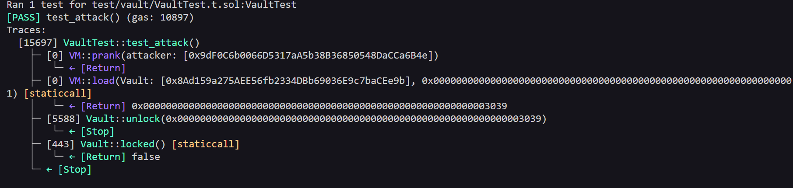

# Token Level - Vault PoC (Proof of Concept)

## Overview
The vault contract has a property `password` marked as `private`. In conventional programming languages this would ensure that the value is inaccessible from outside the class or contract. However, in smart contracts running on the Ethereum Virtual Machine (EVM), all storage is publicly readable on-chain, regardless of the visibility modifier declared in solidity.

## Vulnerabilities Highlighted 

```solidity bool public locked;
    bytes32 private password;

    constructor(bytes32 _password) {
        locked = true;
        password = _password;
    }

    function unlock(bytes32 _password) public {
        if (password == _password) {
            locked = false;
        }
    }
```

## Vulnerability Explained
- Type: Sensitive Data Exposure (Private Storage Leak)
- Root Cause: The `private` modifier in Solidity does not hide data on-chain. It only prevents other contracts from accessing the variable via Solidity code, but the EVM storage is completely transparent and can be read by anyone using `vm.load (Foundry)` or RPC calls like `eth_getStorageAt`.
- Severity: High - Anyone can read the password directly from the storage and call `unlock()` with the correct value, unlocking the contract without authorization.

### Steps of the Exploit PoC

1- Identify the storage slot of the `password` variable
2- Read the value directly from storage.
3- Use the returned value as the argument and call `unlock()`.

### Evidence
##### Local/Foundry

- Tests passing with assertions: 
  -   ` assertFalse(vault.locked(), "false");`

  

##### Real Testnet (Sepolia)  
- [Transaction calling transfer()](https://sepolia.etherscan.io/tx/0x400d7b21471b5de4825f5daba80df71e9fd2e8740f5690faf63cd20088ef097f)

## Recommended Mitigation

- Never store sensitive data on-chain, even if marked as `private`. The EVM storage is publicly accessible.
- If a secret must be used, implement a `commit-reveal scheme` with hashing.
- For authentication prefer mechanisms based on off-chain cryptographic signatures, where the secret never needs to touch the contract state.

## Lessons Learned

- The `private` modifier in Solidity controls only code-level visibility but does not protect against direct storage read via `vm.load` or `eth_getStorageAt`.

## Files
- [Exploit Test Code](../../test/Vault/VaultTest.t.sol)
- [Broadcast Script](../../script/vault/VaultAttack.s.sol)

This is a full Exploit PoC: Reproduced locally with Foundry ans broadcasted on Sepolia testnet