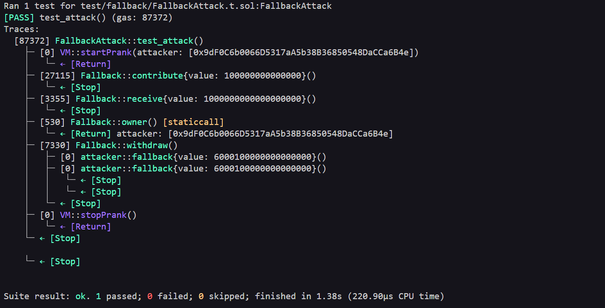

# Fallback Level - Exploit PoC

## Overview
The contract allows **anyone** to become owner with a minimal contribution (> 0 ether), completely bypassing the restrictions in `contribute()` and draining the entire balance via `withdrawal()`.

## Vulnerabilities Highlighted

```bash receive() external payable {
    require(msg.value > 0 && contributions[msg.sender] > 0);
    owner = msg.sender;  # ← Critical: instant ownership takeover with minimal contribution
}

function withdraw() public onlyOwner {
    payable(owner).transfer(address(this).balance);  // # ← Drains entire balance if owner is compromised
}
```

## Vulnerability Explained

- Type: Ownership takeover via permissive fallback/receive function.
- Root Cause: The receive() function sets `owner = msg.sender` without verifying if the contribution is meaningfully larger than the current owner's (it only checks > 0). This bypasses the intended logic in `contribute()`.

- Severity: High
Attacker gains full control with almost zero cost and can immediately drains all funds.

### Steps of the Exploit PoC

1 - Call `contribute()` with a minimal amount.
2 - Send ETH directly to the contract.
3 - Call `withdraw()` as the new owner -> drains the balance to the attacker.

#### Evidence 

##### Local / Foundry
- Tests passing with assertions (owner changed, balance drained).

- [Testnet Sepolia - Contract](https://sepolia.etherscan.io/address/0xf4b006338251d553180941bac54ffd4d676efedf) 

### Recommended Mitigation
 - Remove or heavily restrict the `receive()` function. Prevent `receive()` from changing ownership.
 - Consider using OpenZeppelin's Ownable with explicit transferOwnership instead of fallback-based logic.


### Lessons Learned

- Fallback functions are common vectors for privilege escalation if not properly restricted.
- Minimal checks can be bypassed easily.
- Never allow external calls in fallback without strong access control

[Exploit Test Code](FallbackAttack.t.sol)
[Broadcast Script](../../script/fallback/FallbackAttack.s.sol)


This is a full Exploit PoC: reproduced locally with Foundry, broadcasted on Sepolia testnet.